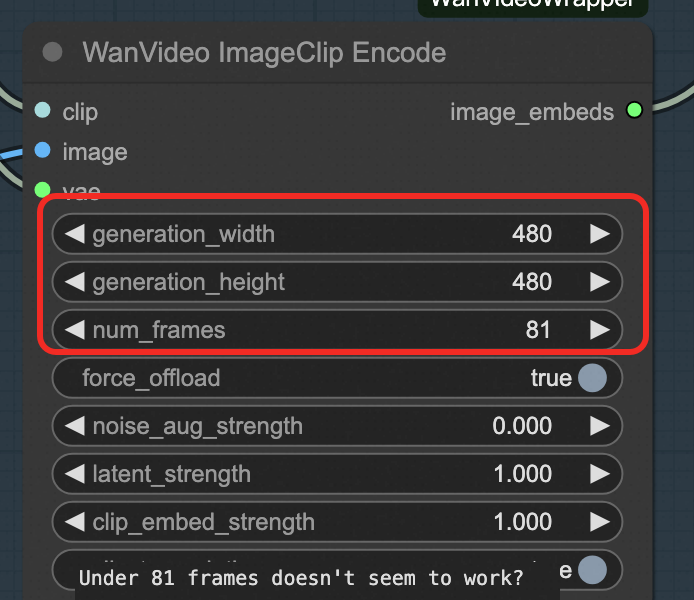

# ComfyUI社区版

>**免责声明：**本服务由第三方提供，我们尽力确保其安全性、准确性和可靠性，但无法保证其完全免于故障、中断、错误或攻击。因此，本公司在此声明：对于本服务的内容、准确性、完整性、可靠性、适用性以及及时性不作任何陈述、保证或承诺，不对您使用本服务所产生的任何直接或间接的损失或损害承担任何责任；对于您通过本服务访问的第三方网站、应用程序、产品和服务，不对其内容、准确性、完整性、可靠性、适用性以及及时性承担任何责任，您应自行承担使用后果产生的风险和责任；对于因您使用本服务而产生的任何损失、损害，包括但不限于直接损失、间接损失、利润损失、商誉损失、数据损失或其他经济损失，不承担任何责任，即使本公司事先已被告知可能存在此类损失或损害的可能性；我们保留不时修改本声明的权利，因此请您在使用本服务前定期检查本声明。如果您对本声明或本服务存在任何问题或疑问，请联系我们。

## 概述
ComfyUI是 最强大的开源节点式生成式AI应用，支持创建图像、视频及音频内容。依托前沿开源模型可实现视频与图像生成。
依据官方文档，ComfyUI具有以下特点：
+ 节点/图形/流程图界面，用于实验和创建复杂的稳定扩散工作流程，无需编写任何代码。
+ 完全支持 SD1.x、SD2.x 和 SDXL
+ 异步队列系统
+ 多项优化 只重新执行工作流中在两次执行之间发生变化的部分。
+ 命令行选项：--lowvram 可使其在 3GB 内存以下的 GPU 上运行（在低内存的 GPU 上自动启用）
+ 即使没有 GPU 也能使用： --cpu（慢速）
+ 可加载 ckpt、safetensors 和 diffusers 模型/检查点。独立的 VAE 和 CLIP 模型。
+ 嵌入/文本反演
+ Loras （常规、locon 和 loha）
+ 超网络
+ 从生成的 PNG 文件加载完整的工作流（含种子
+ 以 Json 文件保存/加载工作流。
+ 节点界面可用于创建复杂的工作流程，如 "Hires fix "或更高级的工作流程。
+ 区域合成
+ 使用常规和内绘模型进行内绘。
+ 控制网络和 T2I 适配器
+ 升级模型（ESRGAN、ESRGAN 变体、SwinIR、Swin2SR 等）
+ unCLIP 模型
+ GLIGEN
+ 模型合并 
+ 使用 TAESD 进行潜伏预览 
+ 启动速度极快。 
+ 完全离线工作：不会下载任何东西。 
+ 配置文件可设置模型的搜索路径。

## 前提条件

| 权限策略名称                          | 备注                         |
|---------------------------------|----------------------------|
| AliyunECSFullAccess             | 管理云服务器服务（ECS）的权限           |
| AliyunVPCFullAccess             | 管理专有网络（VPC）的权限             |
| AliyunROSFullAccess             | 管理资源编排服务（ROS）的权限           |
| AliyunCSFullAccess              | 管理容器服务（CS）的权限              |
| AliyunComputeNestUserFullAccess | 管理计算巢服务（ComputeNest）的用户侧权限 |
| AliyunOSSFullAccess             | 管理网络对象存储服务（OSS）的权限         |


## 计费说明
本服务在阿里云上的费用主要涉及：
* ACS费用
* 跳板机ECS费用
    * 说明：该ECS用于部署和管理K8S集群，/root目录中保存了部署所用到的K8S Yaml资源文件，后期需要修改了参数重新部署可以直接在该基础上修改后重新执行kubectl apply。
      部署完成如不需要也可自行释放。
* OSS费用
  计费方式：按量付费（小时）或包年包月
  预估费用在创建实例时可实时看到。

## 整体架构


## 部署流程

1. 单击[部署链接](https://computenest.console.aliyun.com/service/instance/create/cn-hangzhou?type=user&ServiceName=ComfyUI-ACS%E7%A4%BE%E5%8C%BA%E7%89%88)。根据界面提示填写参数，可以看到对应询价明细，确认参数后点击**下一步：确认订单**。
   

2. 点击**下一步：确认订单**后可以也看到价格预览，随后点击**立即部署**，等待部署完成。
   

3. 等待部署完成后就可以开始使用服务。
   

## 内置模型说明
| 模型名称 | 类型 | 参数规模 | 分辨率 | 量化格式 | 简介 |
|---------|------|---------|---------|----------|------|
| Wan2_1-I2V-14B-480P_fp8_e4m3fn.safetensors | 图生视频 | 14B | 480P | FP8 E4M3FN | WanVideo 2.1图生视频模型，14B参数，支持480P分辨率输出，使用FP8量化以节省显存 |
| Wan2_1-T2V-14B_fp8_e4m3fn.safetensors | 文生视频 | 14B | 标准 | FP8 E4M3FN | WanVideo 2.1文生视频模型，14B参数，直接从文本生成视频，FP8量化版本 |
| flux1-dev.safetensors | 图像生成 | - | 高分辨率 | 标准 | Flux.1 Dev模型，高质量图像生成模型，支持高分辨率输出，开发者版本 |
| wan2.1/Wan2_1-T2V-1_3B_fp8_e4m3fn.safetensors | 文生视频 | 1.3B | 标准 | FP8 E4M3FN | WanVideo 2.1轻量版文生视频模型，1.3B参数，相比14B版本显存需求更低，适合资源受限环境 |

### 如何上传自己的模型
1. 在计算巢控制台找到部署的服务实例，并切换Tab到资源界面，并找到所属产品为对象存储 OSS的资源，点击进入。
2. 访问"文件列表"，在路径为/llm-model/model下为所有类型的模型。
3. 可根据自己的需求上传模型，并重启comfyui客户端即可。

## 使用流程
本服务已经内置了两个可以直接使用的工作流。其中涉及的插件和模型也已经准备好。

### 图生视频或文生视频功能
1. 在下图处选择想要的功能。建议只选择一种进行使用，避免爆内存。
2. 按图中指引选择工作流侧栏，选择wanx-21.json并打开。
3. 在此处选择示例图片或选择自己本机电脑上传。
4. 在TextEncode处填写描述词。上面部分是你想要生成的内容，下面部分是你不想要生成的内容。
5. 在ImageClip Encode处可设置图片的分辨率和帧数。本模型最高可设置720*720。
6. 其余参数可参考官网：https://comfyui-wiki.com/zh/interface/node-options  或以下文档：https://github.com/kijai/ComfyUI-WanVideoWrapper/blob/main/readme.md

### 文生图功能
1. 工作流框处选择该工作流funny_pictures.json。
2. 输入你想要的内容。
3. 这里可以输入一些比较搞怪的内容，比如我这里是关羽大战白雪公主。
4. 可以在此处设置图片的分辨率和图片的数量。如果想加快生产速度，可将batch_size设置为1.
5. 等待图片的生成。

### 图生图功能
访问模版，或自己导入工作流使用。

## API调用

### API 端点概览

| 端点 | 方法 | 功能 | 说明 |
|------|------|------|------|
| `/queue` | GET | 获取队列状态 | 查看当前任务队列 |
| `/prompt` | POST | 提交工作流 | 执行生成任务 |
| `/history/{prompt_id}` | GET | 获取执行历史 | 查看任务执行结果 |
| `/upload/image` | POST | 上传图片 | 上传输入图片文件 |
| `/view` | GET | 下载输出文件 | 获取生成的结果文件 |


支持公网或者私网的API调用。
可参考一下代码实现一个API调用的脚本。
```python
import requests
import json
import time

def run_workflow_file(workflow_file, server="http://127.0.0.1:8188"):
    """运行本地工作流JSON文件"""
    
    # 加载工作流
    with open(workflow_file, 'r', encoding='utf-8') as f:
        workflow = json.load(f)
    
    # 提交
    response = requests.post(f"{server}/prompt", json={"prompt": workflow})
    prompt_id = response.json()['prompt_id']
    print(f"任务提交: {prompt_id}")
    
    # 等待完成
    while True:
        response = requests.get(f"{server}/history/{prompt_id}")
        history = response.json()
        if prompt_id in history:
            break
        print("等待中...")
        time.sleep(3)
    
    # 下载所有输出文件
    outputs = history[prompt_id]['outputs']
    for node_id, node_output in outputs.items():
        # 处理不同类型的输出
        for file_type in ['images', 'videos', 'gifs']:
            if file_type in node_output:
                for file_info in node_output[file_type]:
                    filename = file_info['filename']
                    file_url = f"{server}/view?filename={filename}&type=output"
                    
                    response = requests.get(file_url)
                    with open(filename, 'wb') as f:
                        f.write(response.content)
                    print(f"已下载: {filename}")

# 使用示例
run_workflow_file("my_workflow.json")
```
其中本地工作流采用下图提供的方式来获取：

由于Comfyui未提供官方的API文档，此处仅提供一个完整的示例：关于如何使用API来调用工作流进行文生图或者文生视频等
访问：https://github.com/aliyun-computenest/comfyui-acs/
更完整的调用示例可，找到demo文件夹


### 常见问题
1. 出现某个节点类型不存在，通过manager安装缺少的节点，并重启。

